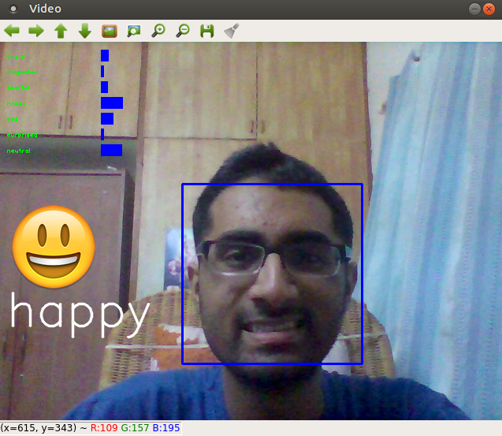

# Emotion-detection

## Introduction

This project aims to classify the emotion on a person's face into one of **seven categories**, using deep convolutional neural networks. This repository is an implementation of [this](https://github.com/atulapra/Emotion-detection/blob/master/ResearchPaper.pdf) research paper. The model is trained on the **FER-2013** dataset which was published on International Conference on Machine Learning (ICML). This dataset consists of 35887 grayscale, 48x48 sized face images with seven emotions - angry, disgusted, fearful, happy, neutral, sad and surprised.

## Dependencies

* Python 3.6, [OpenCV 3 or 4](https://opencv.org/), [Tensorflow](https://www.tensorflow.org/), [TFlearn](http://tflearn.org/), [Keras](https://keras.io/)
* To install the required packages, run `pip install -r requirements.txt`.

## Usage

There are two versions of this repository - written using **TFLearn** and **Keras**. Usage instructions for each of these versions are given below. Both versions work equally well if you want to detect emotions only one face in the image. However, I suggest you use the keras implementation, since it provides better results if there is more than one face.

### TFLearn

* Clone the repository and download the **trained model** files from [here](https://drive.google.com/file/d/1rdgSdMcXIvfoPmf702UCtH6RNcvkKFu7/view?usp=sharing), extract it and copy the files into the current working directory.

* To run the program to detect emotions only in **one face**, type `python model.py singleface`.

* To run the program to detect emotions on all faces close to camera, type `python model.py multiface`. Note that this sometimes generates incorrect predictions.

* The folder structure is of the form:  
  TFLearn:
  * emojis (folder)
  * `model.py` (file)
  * `multiface.py` (file)
  * `singleface.py` (file)
  * `model_1_atul.tflearn.data-00000-of-00001` (file)
  * `model_1_atul.tflearn.index` (file)
  * `model_1_atul.tflearn.meta` (file)
  * `haarcascade_frontalface_default.xml` (file)

### Keras

* Download the FER-2013 dataset from [here](https://anonfile.com/bdj3tfoeba/data_zip) and unzip it inside the Keras folder.

* If you want to train this model or train after making changes to the model, use `python kerasmodel.py --mode train`.

* If you want to view the predictions without training again, you can download my pre-trained model `(model.h5)` from [here](https://drive.google.com/file/d/1FUn0XNOzf-nQV7QjbBPA6-8GLoHNNgv-/view?usp=sharing) and then run `python kerasmodel.py --mode display`.

* The folder structure is of the form:  
  Keras:
  * data (folder)
  * `kerasmodel.py` (file)
  * `haarcascade_frontalface_default.xml` (file)
  * `model.h5` (file)

* This implementation by default detects emotions on all faces in the webcam feed.

* With a simple 4-layer CNN, the test accuracy stopped increasing at around 50 epochs at an accuracy of 63.2%. The top accuracies in the 2013 Kaggle competition for this were 71.16%, 69.27%, 68.82%, 67.48%.

## Algorithm

* First, we use **haar cascade** to detect faces in each frame of the webcam feed.

* The region of image containing the face is resized to **48x48** and is passed as input to the ConvNet.

* The network outputs a list of **softmax scores** for the seven classes.

* The emotion with maximum score is displayed on the screen.

## Example Outputs

## References

* "Challenges in Representation Learning: A report on three machine learning contests." I Goodfellow, D Erhan, PL Carrier, A Courville, M Mirza, B
   Hamner, W Cukierski, Y Tang, DH Lee, Y Zhou, C Ramaiah, F Feng, R Li,  
   X Wang, D Athanasakis, J Shawe-Taylor, M Milakov, J Park, R Ionescu,
   M Popescu, C Grozea, J Bergstra, J Xie, L Romaszko, B Xu, Z Chuang, and
   Y. Bengio. arXiv 2013.

* [Emotion-recognition-neural-networks](https://github.com/isseu/emotion-recognition-neural-networks)